# :star2:Brawl Wiki:star2:
Brawl Wiki is an android application that will allow users to browse player-based data from their Brawl Stars account.

Brawl Wiki can be searched for in the google play store: 
- [Link to google play store](https://play.google.com/store/apps/details?id=com.brawl.brawlwiki)

  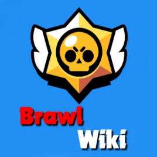

This application includes:
- Video tutorial to learn how to view personal data:heavy_check_mark:
- Option to view personal data from Brawl Stars:heavy_check_mark:
- Option to view top players from Brawl Stars:heavy_check_mark:
- Option to view all brawlers from Brawl Stars:heavy_check_mark:
- Option to view top clubs from Brawl Stars:heavy_check_mark:
- Option to change settings:heavy_check_mark:
## Motivation
The purpose of this application is to demonstrate my android development skills.
This application consists of libraries and best practices such as:
  1. MVVM architecture:heavy_check_mark:
  2. Retrofit(+ GSON):heavy_check_mark:
  3. Room (local database):heavy_check_mark:
  4. Google AdMob:heavy_check_mark:
  5. Google Analytics:heavy_check_mark:
## :camera:Screenshots:camera:

Navigating to the app, will allow the user to insert their brawl stars key to login into the app.

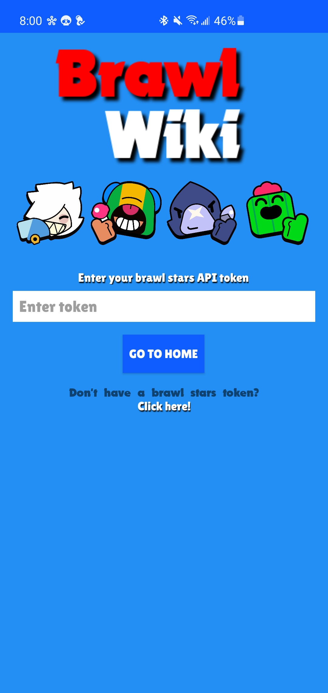

Navigating to the home screen allows users to view a tutorial video on how to login in with their profile ID.

  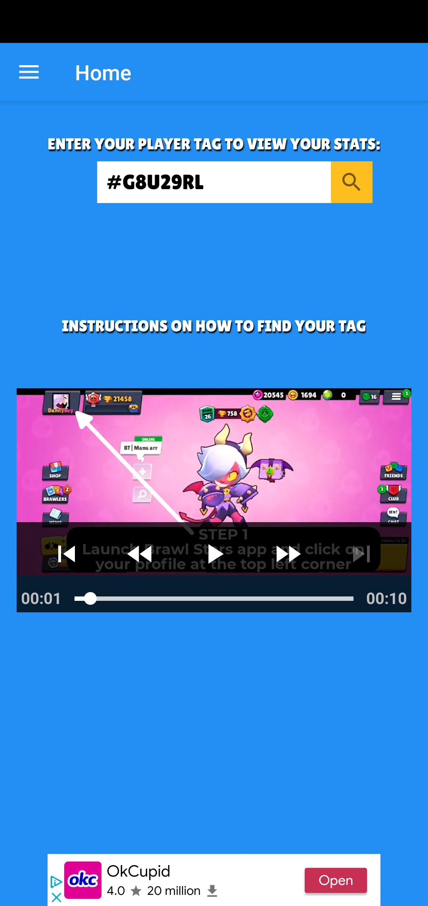
  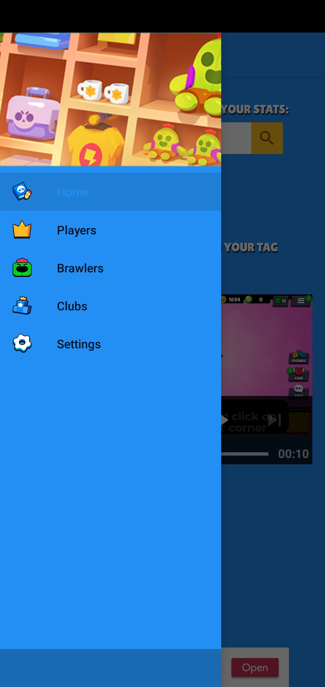
  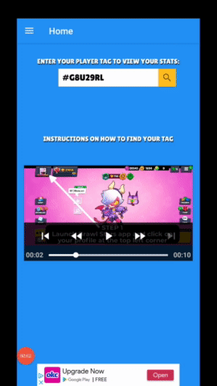

Navigating to one of the options on the navigation drawer will allow users to view brawlers, top clubs, top players, and settings screen.

  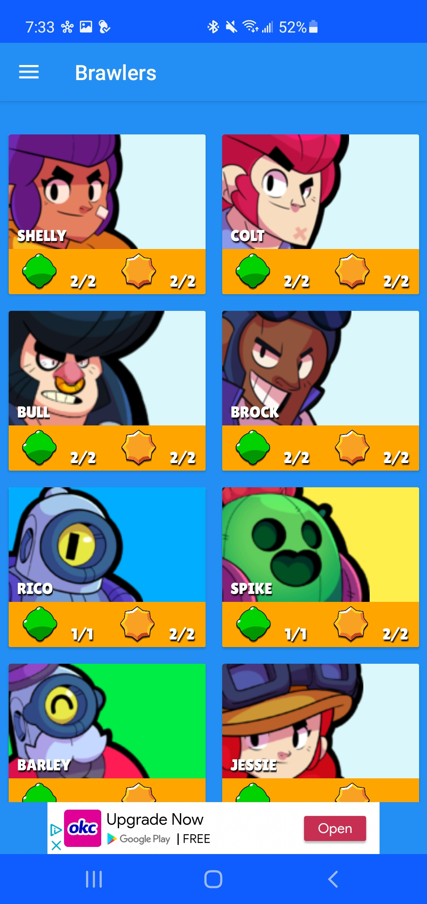
  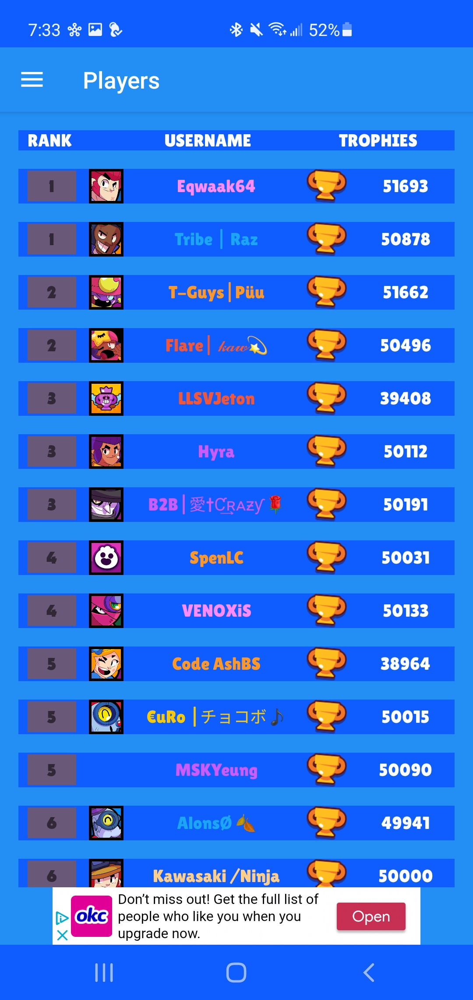
  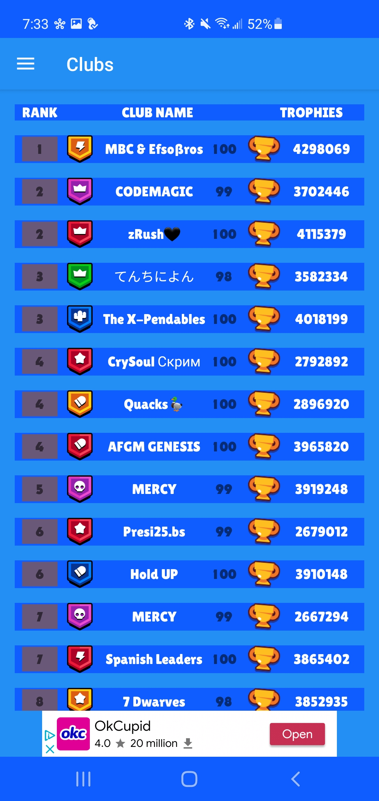
  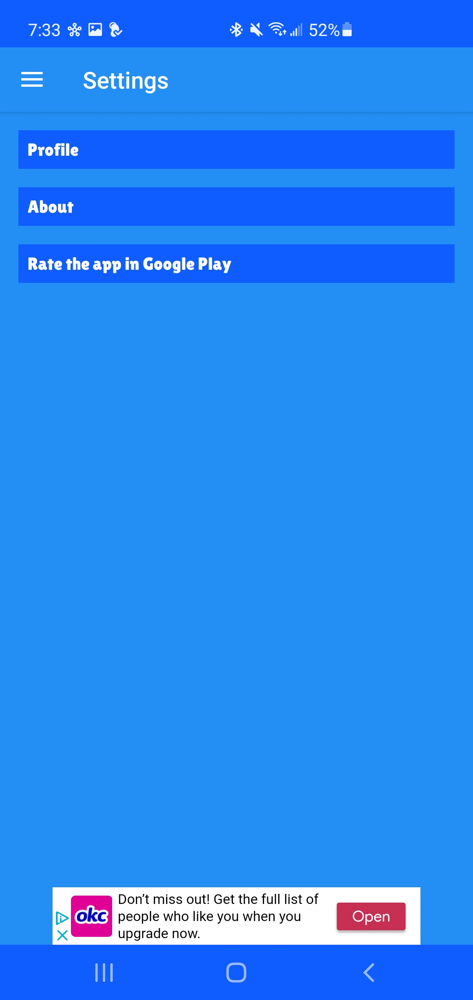

Navigating to a users profile will allow them to view their personal data in the game.

  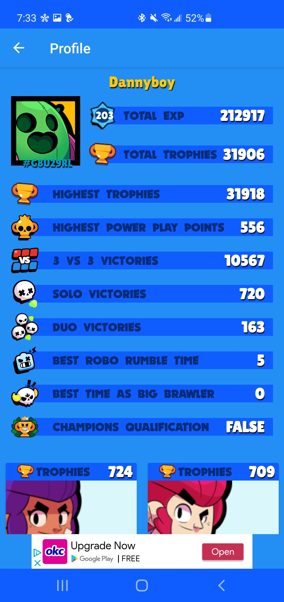
  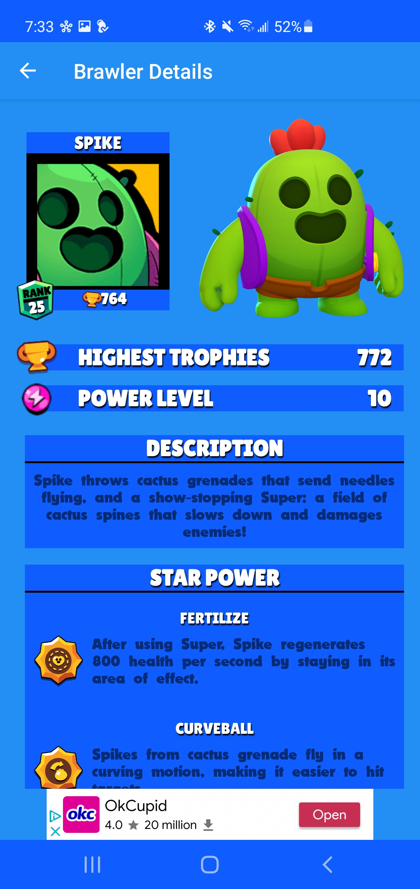

## Framework
**Built with**
- [Retrofit](https://square.github.io/retrofit/)
- [Room](https://developer.android.com/training/data-storage/room)
- [Android Jetpack](https://developer.android.com/jetpack)
- [Gson](https://github.com/square/retrofit/tree/master/retrofit-converters/gson)
- [Google Analytics](https://analytics.google.com/analytics/web/)
- [Google AdMob](https://developers.google.com/admob)

## API Reference
- [Brawl Stars API](https://developer.brawlstars.com/#/):computer:

## License
    Copyright 2021 Daniel Toriz Valdovinos
